# Tables Application - Architecture Diagrams & Flow Charts

## 1. High-Level System Architecture

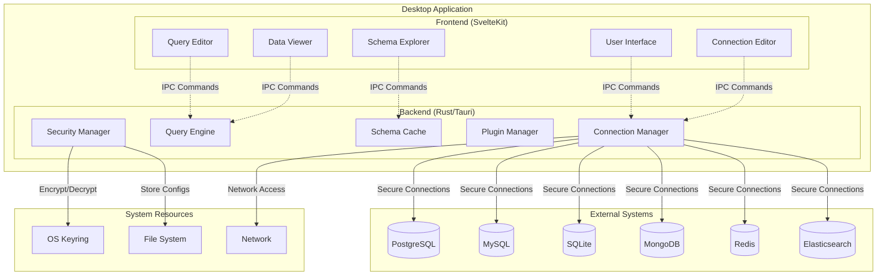

## 2. Security Architecture Flow

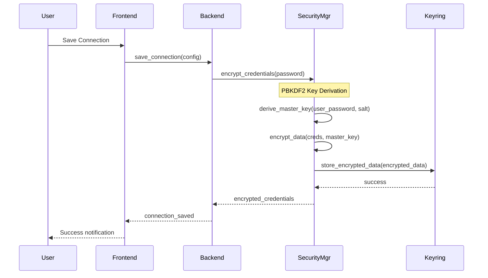

## 3. Query Execution Flow

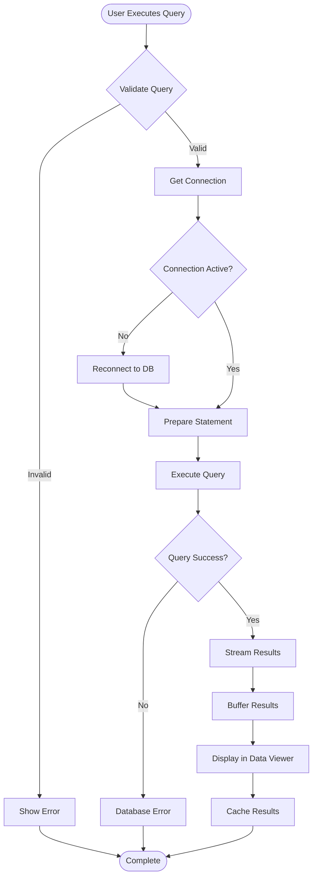

## 4. Component Architecture

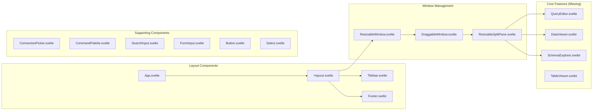

## 5. State Management Flow

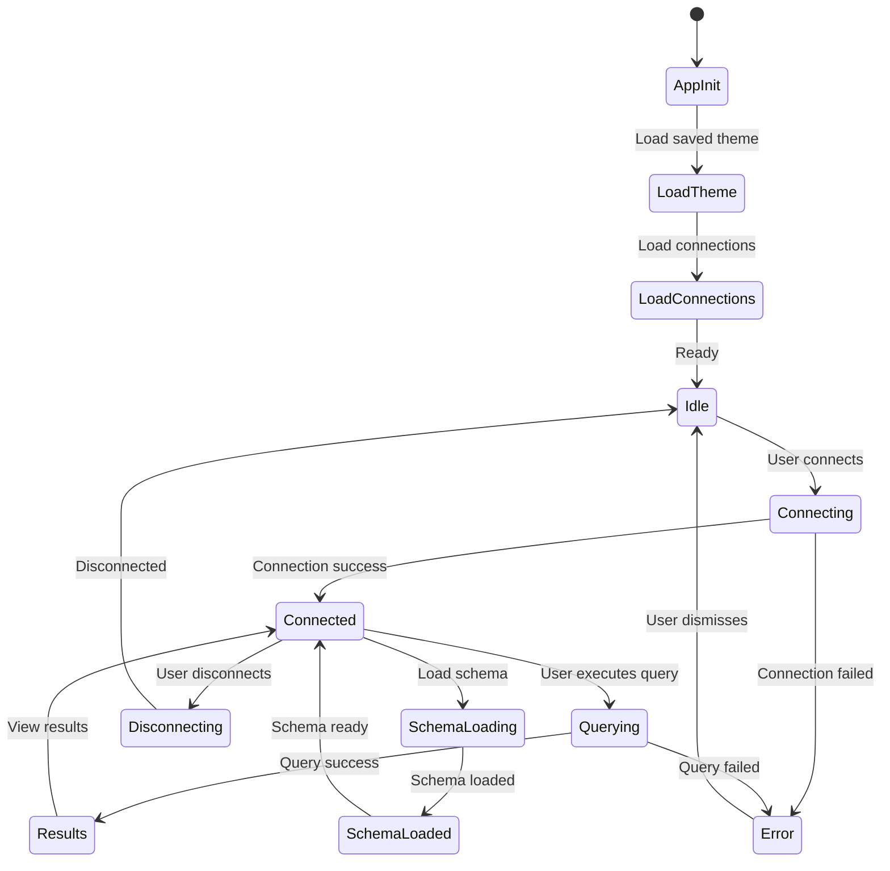

## 6. Database Plugin Architecture

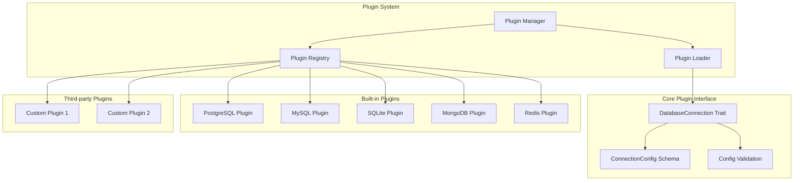

## 7. Current vs Target Implementation

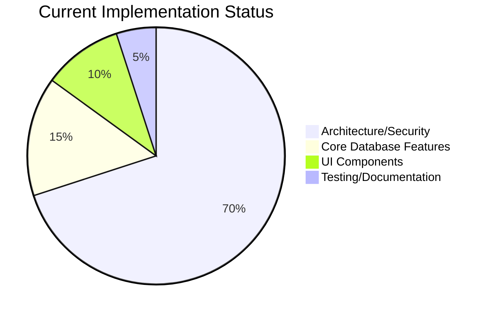

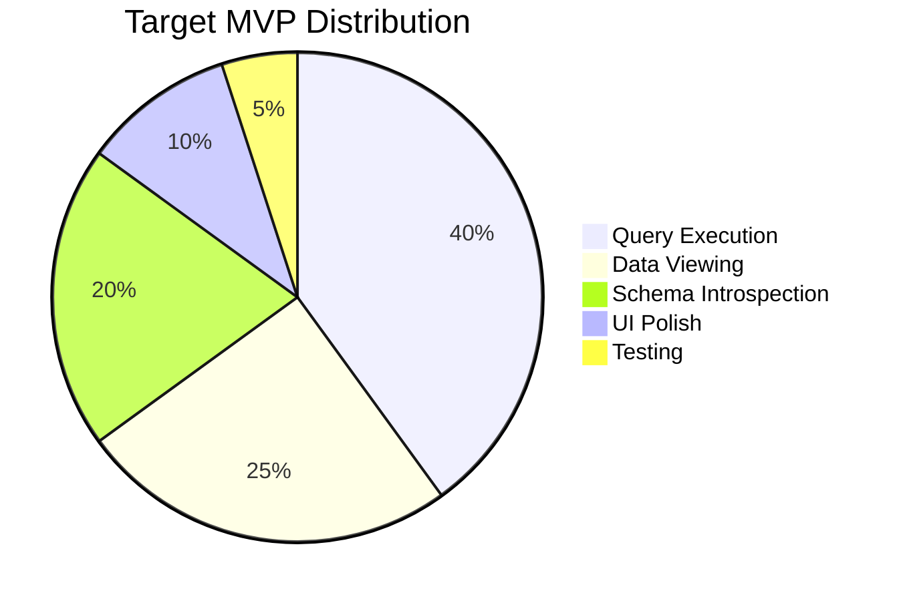

## 8. Performance Optimization Roadmap

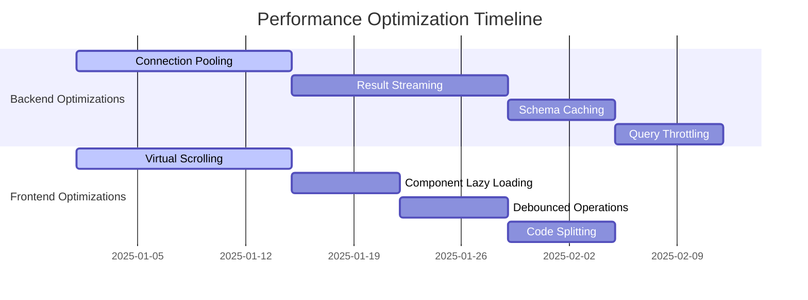

## 9. Error Handling Flow

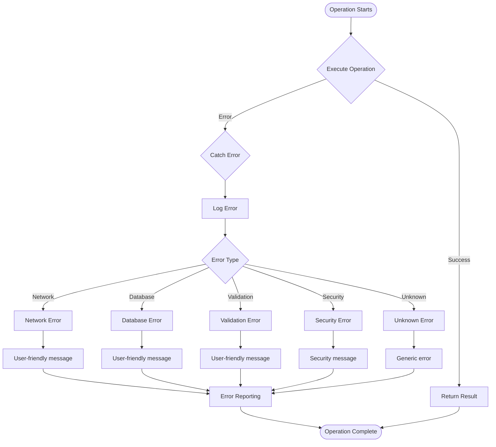

## 10. MVP Feature Dependencies

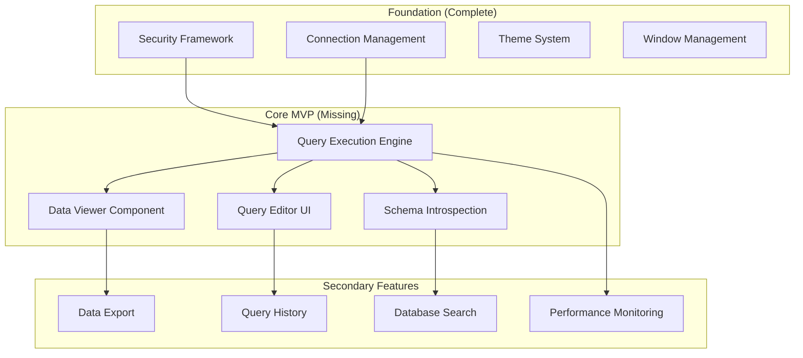

## Key Insights from Diagrams

1. **Strong Foundation**: Security, connections, and UI framework are well-implemented
2. **Missing Core**: Query execution and data viewing are critical gaps
3. **Clear Dependencies**: Core features must be implemented before advanced features
4. **Performance Path**: Clear optimization roadmap for both frontend and backend
5. **Plugin Ready**: Architecture supports extensibility when core is complete

These diagrams provide a visual roadmap for completing the Tables application and highlight the critical path from current state to MVP delivery.